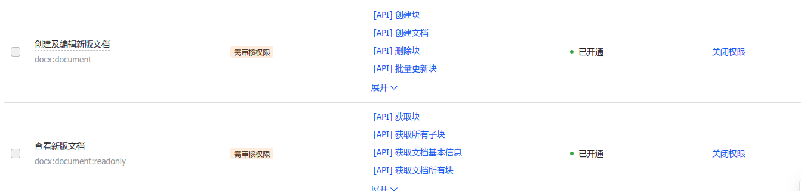

# wx-ai-collect

微信文件传输助手+AI=你的第二智脑

## 实现的功能
1. 收集微信文件传输助手的消息，经过google gemini AI 摘要分类,然后存储到飞书文档，方便收集和检索

## 为什么要做这个

微信是中文互联网信息传播的枢纽，特别是图文信息，除了微信本身的微信公众号以外，还有其中各个平台的都有分享到微信功能，特别是各个APP。
如果你想收集信息，没有什么比分享到“文件传输助手”更方便的了，我就是这样搞的。
但是，文件传输助手收集的信息，没有办法分类整理（需要手工），检索能力较弱，本质是聊天记录，没有办法持久化存储。

受各个微信机器人启发，把微信的文件传输助手改造成为个人智能助手，收集碎片信息，AI分类，摘要，整理成wiki,方便检索，管理。还可以接入各类agent,
怎么样，酷不酷，文件传输助手秒变智能助手

## 部署

### 部署gemini proxy 


[palm-proxy](https://github.com/antergone/palm-proxy)

### 创建飞书应用

需要飞书企业账号

[创建飞书应用](https://open.feishu.cn/app?lang=zh-CN) 拿到 App ID 和 App Secret

权限管理开通以下权限



创建飞书文档，在飞书文档的右上角三个点，更多，添加文档应用，搜索添加创建的应用

这样你就获得了一个可以读写飞书文档的应用

### 本地运行

克隆代码
```bash
git clone https://github.com/captainChaozi/wx-ai-collect.git

cd wx-ai-collect
```

创建python 虚拟环境，安装依赖

```bash
pip install -r requirements.txt
```
修改配置文件，按照注释替换环境变量

```bash
cp .env.example .env
```

修改config.yaml,name是AI分类的类别,id可以在飞书文档url中查看，按照name 进行分类，输出到对应的文档中

```yaml
docs:
  - name: 人工智能
    id: KvLado1XOoMDz3x4Ssncj6QAnrb
  - name: 独立开发
    id: ZG0KdjxWaoqCOFxXZU8cJygQn4d
  - name: 其他内容
    id: HugFd6gpHopDpCxpCI7caXqQnkZ

```
运行celery 跑后台任务

```bash
celery -A  app.celery_app worker 
```

运行api,访问5000端口,可以进行扫码登录
```bash
flask run # 或者python app.py
```

### Docker 部署


```bash
git clone https://github.com/captainChaozi/wx-ai-collect.git
cd wx-ai-collect
docker-compose up -d 
```